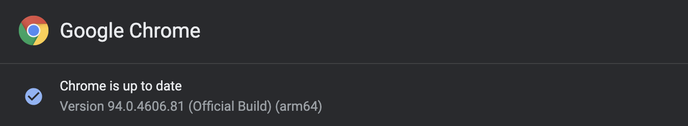

# 使い方説明
## 環境設定
必要なプログラム
```
python3.X
chromeDriver
```

### python 3.Xインストール
1. pythonがインストールされてない場合はpythonのダウンロードを行う
https://www.python.org/downloads/release/python-397/

*注意* : windowsの場合はインストールする際に　`Add Python 3.x to PATH` にチェックすること

### chromeDriverのインストール
1. 自分が現在使用しているchromeのバージョンを確認する


2. 自分のchromeのバージョンに合わせたchromeDriverをダウンロードし、 `search_from_google/app/src/driver` の中に保存する  
https://chromedriver.chromium.org/downloads

3. `sample.env` を `.env` に名前を変更し、以下のように保存する
#### macの場合
```
CHROME_DRIVER_PATH=./app/src/driver/chromedriver
OS_TYPE=MAC
```

#### windowsの場合
```
CHROME_DRIVER_PATH=./app/src/driver/chromedriver.exe
OS_TYPE=WIN
```

### python環境に必要なものをインストール
#### macの場合
1. ターミナルを立ち上げる
2. seach_from_googleフォルダ内にいることを確認
```
$ pwd
```

3. pythonに必要なパッケージをインストール
```
$ pip install -r requirements.txt
```

#### windowsの場合
1. コマンドプロンプトを *管理者権限* で実行し、以下のコマンドを実行する
2. seach_from_googleフォルダ内にいることを確認
```
> @cd
```

3. pythonに必要なパッケージをインストール
```
$ pip install -r requirements.txt
```

注意: 上記のコマンドがうまく動かない時は `pip3 install -r requirements.txt` を実行する


## 実行方法
1. `search_from_google` 内の　`files/input` 内にプログラムを実行したいファイルを配置する
2. windowsの場合は `@cd`  macの場合は `pwd` コマンドを実行し、カレントディレクトリが `search_from_google` であることを確認する
3. `python app/main.py` をコマンドで実行する
4. `seaech_from_google` 内の `files/output` 内にプログラムを実行した結果が配置される

注意: `python app/main.py` がうまく動かない場合は、 `python3 app/main.py` を実行する

## 取り込むデータについて
注意: csvで取り込む際は、1シートずつしかできない

### googleスプレッドシート
ファイル>ダウンロード>カンマ区切りの値(.csv, 現在のシート)  


### エクセル
ファイルを保存する際に拡張子 `CSV UTF-8(コンマ区切り)(.csv)` を選択する  


## データを取り込む方法
### googleスプレッドシート
1. ファイル>インポートを選択する  

2. アップロードから対象ファイルを選択する

### エクセル
注意: エクセルで取り込む場合は文字化けするので、以下の対応を行う
1. 出力されたファイルをメモ帳で開く
2. 何も変更せず名前をつけて保存ボタンを押し、エンコードを `UTF-8(BOM付き)` を指定する  


## テスト実行方法
1. `pipenv install`
2. `pipenv run test`

